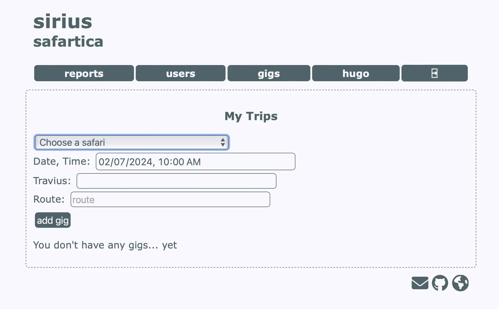

# sirius, safari class
Minimalistic **safari class** and **accident report** web application.

  

## users
Just an **email** is needed to create a user. Invitation to _register_ by _email_. Only the user can **edit his own data**. An _unregistered_ user will be deleted after **one day**. A **validated user** will be automatically logged out after **3 min** of **inactivity**. 

### userlevels
* **inactive**: _limbo_ status, can not log in.
* **guide**: create and update his own data, issues, trips, close calls and _anonymous feedback_.
* **admin**: same privileges as _guide_ plus upgrade userlevels, download [_vcards_](https://en.wikipedia.org/wiki/VCard) and [CSV](https://en.wikipedia.org/wiki/Comma-separated_values) reports.
* **superadmin**: same privileges as _admin_ plus create and modify admins.

## safaris
This are the _templates_ of the _trips_. A safari has a **unique name**, a duration and when _active_ is _available_ for the _trips_.

## trips
An _active user_ can _add_ and _update_ trips. A trip has a _safari name_, _time_ and a _route_. _Remarks_ can be added later. A trip can have _near misses_.

## anonymous feedbacks
On the _user account_ there is the possibility to update an anonymous feedback.

## reports
The admins can download trip, near miss and anonymous feedback in CSV format, [spreadsheets](https://en.wikipedia.org/wiki/Spreadsheet) suported by [Apple Numbers](https://en.wikipedia.org/wiki/Numbers_(spreadsheet)), and [LibreOffice Calc](https://en.wikipedia.org/wiki/LibreOffice_Calc) among others.

## built with
    
* [OpenBSD 7.4](https://www.openbsd.org)
* [PHP 8.2](https://www.php.net)
* [MariaDB 10.9](https://mariadb.com)
* [HTML5](https://html.spec.whatwg.org)
* [CSS3](https://www.w3.org/TR/CSS/#css)

## roadmap

* [x] automatic darkmode
* [x] responsive
* [x] manage users and userlevels (inactive, guide, admin)
* [x] registration and password recover by mail
* [x] guide contact vcards
* [x] create and update personal trips
* [x] report close calls
* [x] download CSV reports
    - [x] trips
    - [x] trip near misses
    - [x] anonymous feedback
* [ ] update weather conditions automatically
* [ ] add accident report
* [ ] accident report pdf
* [ ] svg icons
  - [x] buttons
  - [ ] menu
